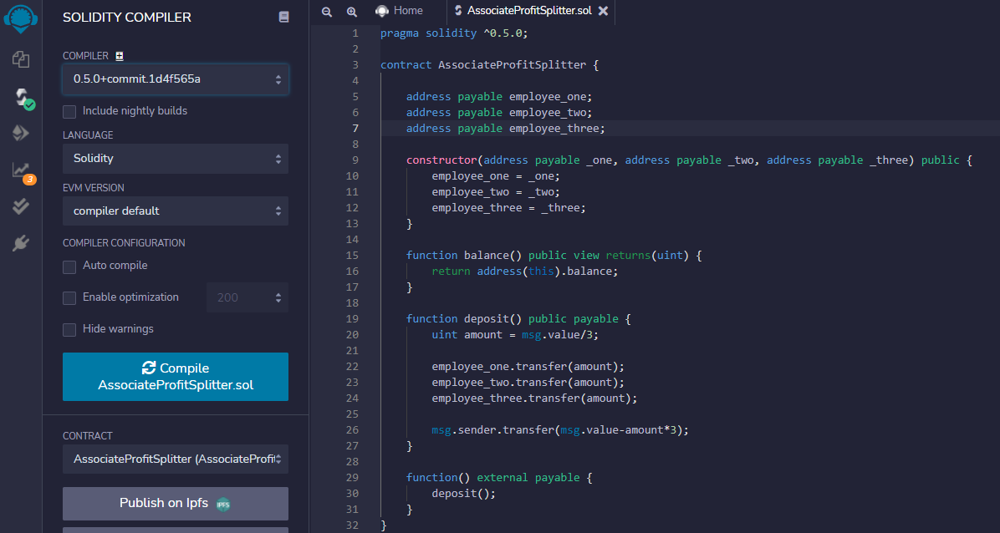
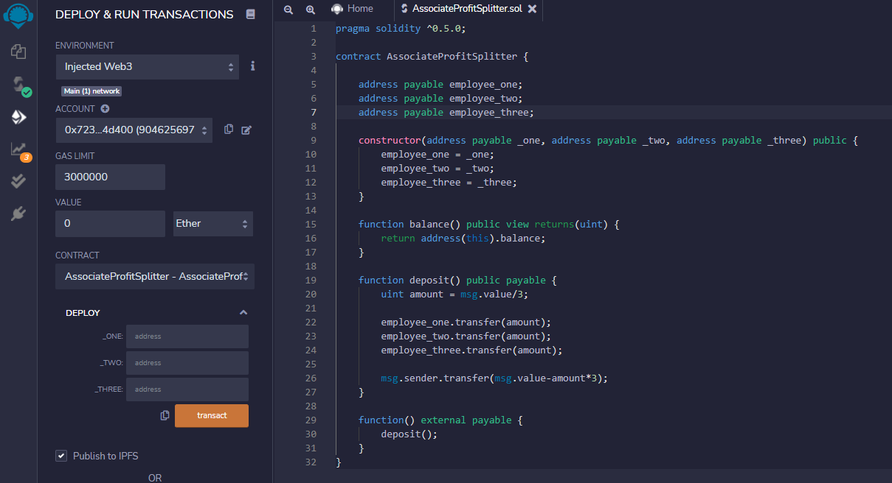

# Solidity 101. With Smart Contracts

## Creating a smart contract to split profit to multiple addresses
|

###  Technology & software Requirements.

To Code on Solidity and be able to accurately trial and run the smart contract you must have certain applications for use, and technology installed.

They are as follows.

1.Python

      i. Python is required to code on the blockchain in this circumstance.
 
 2.Go Ethereum Tools(GETH) v 1.9.7

      i. This can be installed online at https://geth.ethereum.org/downloads/
      
 3.MetaMask wallet.

      i. A MetaMask wallet extension must be downloaded on Google Chrome.
      you will need to create an account, be sure to write down your recovery passphrase somewhere, as it is essential to accessing your account.
      Make sure you are hooked up to your local host account.

 4.Ganache.
     
      i. Ganache must be installed to be bale to look at transactions and check the contract is doing as it should. It can be installed at https://trufflesuite.com/ganache/.

 5.Remix IDE
     
      i. Most coding in solidity on Ethereum is done on remix.ethereum.org.

### Starting the Project.

The smart contract, named "AssociateProfitSplitter", will accept ether in the contract and divide it evenly among employees, the use case for this is to be able to pay employees quickly and efficiently.

The First thing to do is code the contract, given the simplicity of the use case, the contract will be quite basic. The code will look as such.

-make sure the compiler matches the version in the above code "0.5.0 & the language is solidity.

-The code above outlines the contract, in which is includes 3 addresses payable at the top, this can easily be manipulated to add more or less.

-Included is a function that shows the sending accounts balance, and to return any un used balances to this address.

-The last part of the code consists of the function to send the uint ammount (positive intiger only) to the addresses presented, and then dividing it by the number of associates/addresses to pay.

|

|

### deploying and run the contract

Navigate to the "deploy & run section on Remix IDE, Connect to the injected web3 environment.

Link your local host account, and run mining nodes to deposit test funds in to there. If you are unsure how to do this, follow the link for a guide on how to create your own blockchain on the localhost. https://github.com/maxm1998/blockchain-homework/tree/main/bnetwork-1.

pick a value to send, and put in 3 addresses from Ganache into the deploy "addresses" section, click transact.

If the transaction was succesfull, you should see the ammounts enter the wallets in Ganache, and leave your metamask account.

If this is the case, you are now up and runnning to pay employees via smart contracts.

the contract should look like this.

