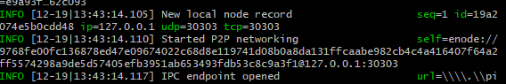

                          
               # POA-DEV-Chain

## How to create and Run a Proof of Authority Dev-Chain network.

### Technology & Software Requirements.

In order to create and run the blockchain POA algorithm succesfully you must install some pre requisites.

The requirement are as follows:
 
 1.Python

      i. Python is required to code on the blockchain in this circumstance.
 
 2.Go Ethereum Tools(GETH) v 1.9.7

      i. This can be installed online at https://geth.ethereum.org/downloads/
      
 3.MetaMask wallet.

      i. A MetaMask wallet extension must be downloaded on Google Chrome.
      you will need to create an account, be sure to write down your recovery passphrase somewhere, as it is essential to accessing your account.

## Creating The Blockchain

The following is a step by step guide to setting up the genesis blocks, approving the nodes, and running the nodes to mine.

-- 1. Create accounts for nodes.
 
 Running a POA Algorithm on blockchain requires the accounts(nodes) to be approved, in order to do so, we will generate two new nodes with acount addresses. 
 
 The Code: 
 
 Navigate in to the GethTools Directory in your native terminal, and execute the following code to create 2 new nodes.
 
     i. ./geth --datadir node1 account new

        ./geth --datadir node2 account new
   
 Enter a Password for both nodes, and they will be created.
 Upon creation of the nodes, you will be given an account address for both, it is important to save this address somewhere safe for further usage.

 -Creating a Node

 

   
--2. Generating a Genesis Block.

   i.Run Puppeth by executing the following code: ./puppeth, and name The    Network "ZBank".

   ii.Choose Clique(proof of Authority) algorithm. 

   iii.paste both account addresses from the last step into the list of accounts to seal.

   iv.Create a Chain ID, and write that down in another document for further use.

   v. Once back at the main menu, go to "manage existing genesis",
   then to Export genesis configurations. This will attempt to create 4 json files, you only need the one called "ZBank.json"
   
   -The Genesis Block is now completed, the code should look like this when creating the block
   
 
   
   
   
   
--3. Initialise Nodes to Genesis File.

   i.Using Geth from the Geth-Tools directory, you must initialize the new nodes with the ZBank.json File.

   The Code:
 
        ./geth --datadir node1 init ZBank.json

        ./geth --datadir node2 init ZBank.json

   It is important to note that the network name, shown in the .json file, is variable, and can be changed at yuor discretion, in that case, the file would be "networkname".json.

   This initialises the nodes with the Genesis Block, and prepares them for mining.

   Output should look like this:

   

--4. Begin Mining Node 1

   i.You can Now Begin mining
    Open 2 seperate terminals.

   in the first terminal, navigate to your Geth-Tools folder, and execute the following code:

     ./geth --datadir node1 --unlock "SEALER_ONE_ADDRESS" --mine --rpc    --allow-insecure-unlock

The SEALER_ONE_ADDRESS is the public key you noted down from your first node.

enter your password for node1 after inputting the code.

Take node of the Enode Address, copy it for safekeeping as it is used in the next step.

--5. Begin Mining Node 2

   i.You can now begin mining on the second Node.
   Open your second Terminal, and execute the following code.

      ./geth --datadir node2 --unlock "SEALER_TWO_ADDRESS" --mine --port 30304 --bootnodes "enode://SEALER_ONE_ENODE_ADDRESS@127.0.0.1:30303" --ipcdisable --allow-insecure-unlock

The Enode Address from the last step will be inserted just after bootnodes, in the format shown above,

You must also insert your password after executing the Code.

the Nodes should then begin mining.

--6. Add Network to MetaMask Wallet
   
   i.Log in to your MetaMask wallet, using your 12 word passphrase you were given when creating an account.

   ii.Click "Add Network", the page should look like this:

   

   iii.Add the Network Name, ZBank in this insatance.

   - Add the Chain ID that you created when making the Genesis Block.
   
      The Rpc url is Local host,
   ( https://127.0.0.1:8545)

     leave the other options blank.

iv. Now we Need to import the node Accounts into MetaMask, in order to transfer between.

- Navigate to accounts menus and click "import account"

- You must then import your Account using the Json file in your node.

   To do this, navigate to your Node1 Folder, then to Keystore. Import this file onto the MetaMask app, and wait patiently for it to import.

   Repeat this process with the second node, making a seperate account on the same network.

--7. Sending Coins.

   We can now send coins between internal and external accounts.

   To Send Money between accounts simply click "send"
   paste the address of the wallet you intend to send to, choose the coin and ammount to send.

   You can increase the GasPrice to have the transaction clear quicker, gas price is the Fee for sending transactions.

   Once cleared the transaction should look like this.

   

   You can Follow the Transaction ID to see all the relevant details of the transaction.

\
\
--You can now create a Blockchain and send currencies using a proof of authority blockchain.